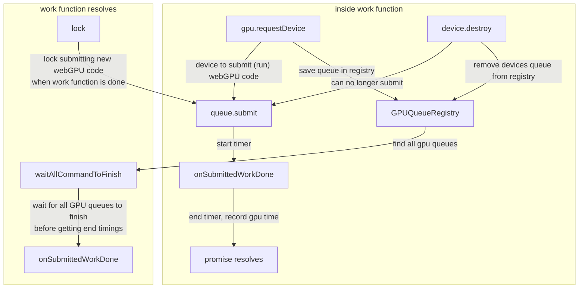

# Timing webGPU in the evaluator

Explanation is in `libexec/sandbox/lift-webgpu.js`, diagram for flow is:

```mermaid
flowchart TD
    subgraph inside work function
        requestDevice[gpu.requestDevice] -->| save queue in registry| GPUQueueRegistry
        destroy[device.destroy] -->| remove devices queue from registry| GPUQueueRegistry
        userSubmit[queue.submit] -->| start timer| onSubmittedWorkDone
        requestDevice -->|"device to submit (run) webGPU code" | userSubmit
        onSubmittedWorkDone -->|end timer, record gpu time| resolves[promise resolves]
        destroy -->|can no longer submit| userSubmit
    end

    subgraph work function resolves
        lock -->|lock submitting new webGPU code\nwhen work function is done| userSubmit
        waitAllCommandToFinish -->|wait for all GPU queues to finish\nbefore getting end timings| onSubmittedWorkDone2[onSubmittedWorkDone]
        GPUQueueRegistry --> |find all gpu queues| waitAllCommandToFinish
    end
```